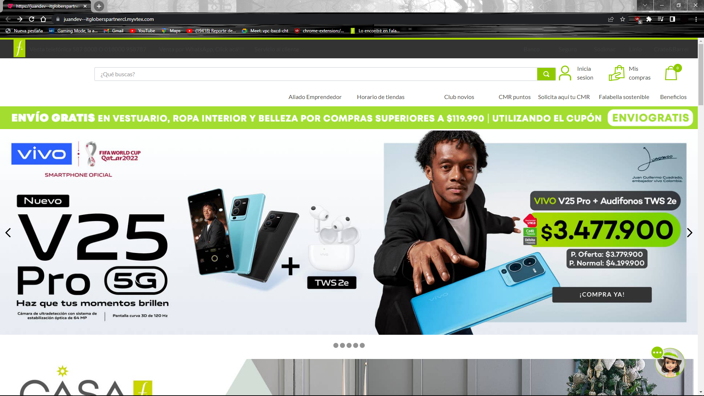

<h1 align="center"> store-theme-falabella </h1>
 

<h1 align="center"> INDICE </h1> 
 -Título e imagen de portada
 -Índice
 -Descripción del proyecto
 -Estado del proyecto
 -Tecnologías utilizadas
 -Persona-Desarrolladores del proyecto

<h1 align="center">Descripción del proyecto</h1>
La idea de este proyecto fue hacer una breve copia de la pagina web que en este caso fue falabella una de las razones por lo que se hizo este proyecto fue para aprender a usar VTEX  y tener una buena experencia con esta tecnologia,algunos beneficions que nos da al desarrollar con VTEX IO en un store-theme nos da un amplio campo laboral,libertad de desarrollo etc...
<h1 align="center">Estado del proyecto </h1>
EL estado del proyecto todavia se encuentra en 🚧 construccion 🚧
 <h1 align="center">Tecnologías utilizadas</h1>
 -Visual Studio Code
 -Yarn
 -Git
 -Vtex Toolbet
 -Librerias de VTEX IO(React.JS, GraphQL, Node.JS)
  <h1 align="center">Persona-Desarrolladores del proyecto</h1>
   <h1 align="center">Juan Esteban Aguilera Araque</h1>

